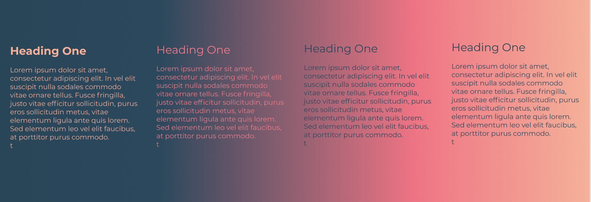

# Richard Sando Portfolio

https://unruffled-hermann-92977b.netlify.com/

https://github.com/richardsando/portfolio

The purpose of this website is to demonstrate some of the skills which I possess and to serve as a portfolio page that can be shown to potential employers. 

# Features/functionality

The page is divided into four sub-pages: main, about, skills, and contact. All of these sub-pages are self contained witihin the one page which scrolls down vertically. I did this so that the user can quickly navigate without having to change pages(in a way).

The main navigation menu is visible on each page so the user can navigate to any other page from anywhere withing the site. The current page is highlighted on the nav menu so the user knows where they are.

I included a fixed (which means it is visible at all times) social media tray on the left hand side of the screen which allows the user to quickly contact me on various social media sites. The tray also includes a link to my Github, gmail and my Vimeo page.

The main page has a brief intro and a headshot photo. Just so the user knows that I am a human being. The about page includes a litte more in depth information about me, my hobbies etc.
The skills page includes the specific languages/frameworks that potential employers may be interested in seeing. Finally, the contact page just includes a contact form as well as my email address and phone number.

I have added a number of elements to the site to make is visually appealing and to add a personal touch. The background image, for instance, is a piece of 3d art which I have created. The image is saved as a .png file so there is transparency where there is no pixel values.

The target audience is potential employers and generally people who may be interested in some of the stuff I get up to.

The technologies used include figma (for creating a mockup of the website), html and css. Github was used to save changes and Netlify was used to deploy the website.

# Design

I used pinterest.com to browse for ideas and create a general moodboard in the direction I wanted to go.
https://www.pinterest.com.au/richardsando/website-inspo/

Figma was used extensively to create designs for the webpage as well as determine which colours and fonts to use in the webpage.

https://www.figma.com/file/eS4h05f5d81hNHs1p7iPrnOJ/warm-colours-idea?node-id=2%3A2

Code was often copied straight from Figma into the css file of the website(such as the gradient background)

The first element I created was the body background using a gradient and a 3d art image which I created.
These colours are quite appealing and often used in movies and can be seen in nature ie sunset, sunrise. Gradients are also very popular in web pages at the moment.

A usability concern I encountered was the colour of the text against the varying tone of the background gradient. At the start of the page the text would be highly contrasted to the background, however, at the end of the page the colour of the text was very similar, making it not very legible. Too remedy this I changed the colour of the background slightly, thus making the text and social media icons more legible.

Another usability concern was scaling the website down to mobile size. I used a number of media queries within my css to change the layout of particular elements(such as the social media panel switching to the bottom of the screen when reaching a certain minimum width) Text was also scaled down. The layout of some of the pages had to be altered so everything would sit nicely.

The background image I spent a lot of time optimizing and deciding what would be the correct resolution. In the end I went with an images that was 720 pixels wide. When the screen is 720p wide or smaller, the images will stay fixed, meaning the image will not become squashed or stretched. I also converted the image to 8bit from 32bit to greatly reducde the size of the file, making the site load faster for slower bandwidths. Another media query was used so that if the user's screen is wider that 720 pixels then the image will stretch. This will only slightly distort the image.

Trello was used to track progress of each task

# Q & A

#### 1. Describe key events in the development of the internet from the 1980s to today (max. 150 words)

Key events in the development of the internet included:

In 1982 the Simple Mail Transfer Protocl was introduced. In 1983 domain name system (DNS) was pioneered,creating domain names such as .com .edu .gov etc and making is easier to navigate urls. In 1990 hypertext was created. 1991, the world wide web is launched. In 1998 google is foundded

#### 2. Define and describes the relationship between fundamental aspects of the internet such as: domains, web servers, DNS, and web browsers (max. 150 words)

Websites are files on servers' hard drives. Servers are connected to each other via the internet. Each server has a unique ip address, which is just like a postal address. When users enter a website address into their web broweser (such as www.google.com) the domain name system (DNS) then converts this to an ip address, thus connecting us to the website. This saves us from having to remember specific ip addresses for websites. Personal computers do not have servers as they are not directly connected to the internet. They are connected via an internet servce provider (isp). 

Whenever information is sent from one place to another on the internet, it is broken down into smaller chunks called packets. A router is used to direct where these packets go and come from. 

#### 3. Reflect on one aspect of the development of internet technologies and how it has contributed to the world today (max. 150 words)

Google was founded in 1998 as a search engine for finding things on the internet and quickly become the most used website on the web. It has made it so easy for people to access information about anything they like, providing they have access to the internet. Google is now one of the biggest companies in the world. Without it, it may be a lot harder for people to find information about the specific topic they are looking for one the web.

